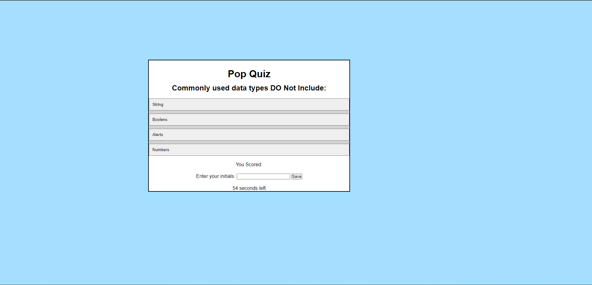

# legendary-barnacle

## Description

AS A coding boot camp student
I WANT to take a timed quiz on Javascript fundementals that stores high scores
SO THAT I can gaguge my progress compared to my peers

GIVEN I am taking a code quiz
WHEN I click the start button
THEN a timer starts and I am presented with a question
WHEN I answer a question
THEN I am presented with another question
WHEN I answer a question incorrectly
THEN time is subtracted from the clock
WHEN all questions are answered or the timer reaches 0
THEN the game is over
WHEN the game is over
THEN I can save my initials and my score

## Usage

This quiz is to help ones better understanding of the JavaScript language. It will score you on how many questions you get correct. When the correct answer is picked, you will be alerted that your choice is correct! At the end it will display your score and you can input your initals. (check local storage for the data). Questions can be added or changed depending on what you desire to test someone on .

## Installation

N/A

## License

N/A

